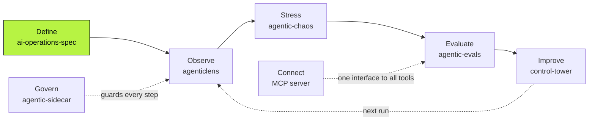

<div align="center">

<a href="https://deepagentlabs.io">
  
</a>

# DeepAgentLabs

### AI operations need a shared language.

Open-source tools to **observe, test, evaluate and govern AI agents in production**,
all built on one vendor-neutral specification.

[](https://deepagentlabs.io)
[](https://discord.gg/fEqPFWgcDG)
[](https://www.linkedin.com/company/deepagentlabs)
[](https://www.instagram.com/deepagentlabs.io)

[**Website**](https://deepagentlabs.io) ·
[**Specification**](https://github.com/DeepAgentLabs/ai-operations-spec) ·
[**Roadmap**](https://deepagentlabs.io/roadmap.html) ·
[**Remote MCP**](https://mcp.deepagentlabs.io) ·
[**Discord**](https://discord.gg/fEqPFWgcDG)

<br>


</div>

---

## Why DeepAgentLabs

AI agents are moving from demos to production, and the hard questions change:
*What is the agent actually doing? What did that run cost? Did it make the right decision?
What happens when a tool fails?*

Today every framework and every tool answers those questions in its own format.
Your LangGraph traces can't be compared with your CrewAI runs, your evals don't
talk to your dashboards, and nothing gates a release.

**DeepAgentLabs fixes that with one shared contract.** The
[AI Operations Specification](https://github.com/DeepAgentLabs/ai-operations-spec)
defines what a run, a step, a tool call, an evaluation and an incident *are*.
Every DeepAgentLabs tool speaks it, so they work together and work with any framework.

<table>
<tr>
<td width="25%" align="center"><b>Spec comes first</b><br><sub>One vocabulary for runs, steps, evals and incidents</sub></td>
<td width="25%" align="center"><b>Works with any framework</b><br><sub>LangGraph, CrewAI, OpenAI Agents SDK, AutoGen, LlamaIndex, your own</sub></td>
<td width="25%" align="center"><b>Runs on your machine</b><br><sub>Local-first: runs where your agents run</sub></td>
<td width="25%" align="center"><b>Free and open source</b><br><sub>Every package is public on GitHub and PyPI</sub></td>
</tr>
</table>

## One loop, five stages



Define the contract once, then observe, stress-test, evaluate and improve every agent against it.

## The ecosystem

| Package | What it does | Install |
|---|---|---|
| **[AI Operations Specification](https://github.com/DeepAgentLabs/ai-operations-spec)** | The vendor-neutral contract for runs, steps, model and tool calls, evaluations and incidents. JSON Schema artifacts, v0.1–v0.4. | — |
| **[AgenticLens](https://github.com/DeepAgentLabs/agenticlens)** | OpenTelemetry-native observability: OTLP traces, cost and token tracking, p50/p95 latency, release gates and cost-cutting recommendations. | `pip install agenticlens` |
| **[Agentic Evals](https://github.com/DeepAgentLabs/agentic-evals)** | Framework-agnostic scoring: deterministic checks, 10 LLM-judge rubrics, trajectory and tool-call scorers, behind a pass/fail CI gate. | `pip install agentic-evals` |
| **[Agentic Chaos](https://github.com/DeepAgentLabs/agentic-chaos)** | Fault injection and drift testing: timeouts, rate limits, corrupted outputs and tool failures, forced before production does it for you. | `pip install agentic-chaos` |
| **[Agentic Sidecar](https://github.com/DeepAgentLabs/agentic-sidecar)** | A real-time Decision Gate that checks an agent's next action against its intent: Allow, Warn or Block. | `pip install agentic-sidecar` |
| **[AgenticOps Control Tower](https://github.com/DeepAgentLabs/agenticops-control-tower)** | Fleet-wide registry and control plane: which agents exist, what they run on, and what needs attention. | `pip install agenticops-control-tower` |
| **[DeepAgent MCP](https://github.com/DeepAgentLabs/mcp-server)** | One MCP interface over Lens, Chaos, Sidecar and Spec validation: 14 tools any MCP client can call. Also hosted at [mcp.deepagentlabs.io](https://mcp.deepagentlabs.io). | `pip install deep-agentic-core-mcp` |

### Downloads

| AgenticLens | Agentic Evals | Agentic Chaos | Agentic Sidecar | Control Tower | DeepAgent MCP |
|:---:|:---:|:---:|:---:|:---:|:---:|
| [](https://pepy.tech/project/agenticlens) | [](https://pepy.tech/project/agentic-evals) | [](https://pepy.tech/project/agentic-chaos) | [](https://pepy.tech/project/agentic-sidecar) | [](https://pepy.tech/project/agenticops-control-tower) | [](https://pepy.tech/project/deep-agentic-core-mcp) |

## Quick start

```bash
pip install agenticlens agentic-evals
```

Then pick a guide in each package's README:
[AgenticLens](https://github.com/DeepAgentLabs/agenticlens) for tracing and cost,
[Agentic Evals](https://github.com/DeepAgentLabs/agentic-evals) for scoring and CI gates.
Want everything from one MCP client? Point it at [mcp.deepagentlabs.io](https://mcp.deepagentlabs.io).

## Roadmap

The specification grows one layer at a time, reviewed in the open.
Full details on the [roadmap page](https://deepagentlabs.io/roadmap.html).

| Version | Milestone | Status |
|---|---|---|
| v0.1 | **Core concepts:** shared meaning for runs, steps, agents and tools | In review |
| v0.2 | **Relationships:** how the pieces connect into execution graphs | Exploratory |
| v0.3 | **Semantics:** standard event names and lifecycles | Exploratory |
| v0.4 | **JSON Schemas:** artifacts anyone can validate | Exploratory |
| v0.5 | **Versioning:** rules for safe, compatible changes | Planned |
| v0.6 | **Extensions:** canonical examples and third-party extensions | Planned |
| v0.6.x | **Provenance:** evidence, lineage and conformance tests | Planned |
| v1.0 | **Stable standard:** a frozen spec anyone can implement | North star |

## Community

DeepAgentLabs is an open-source AI research and learning community. We run
**hands-on workshops**, **technical sessions** and **research**, and ship it all as **open source**.

- **[Discord](https://discord.gg/fEqPFWgcDG):** ask questions, share traces and failing runs, hear about workshops first
- **[LinkedIn](https://www.linkedin.com/company/deepagentlabs):** releases, workshop announcements and technical write-ups
- **[Instagram](https://www.instagram.com/deepagentlabs.io):** behind the scenes from sessions and events
- **[GitHub](https://github.com/DeepAgentLabs):** star the repos, open issues, send pull requests

**Help define how AI systems are operated.** The standard is early by design. If you build
agent frameworks, AI tooling or reliability practices, now is the time to shape it:
[join the discussion on the spec](https://github.com/DeepAgentLabs/ai-operations-spec).

---

<details>
<summary><b>About this repository (the website)</b></summary>

<br>

This repo is the source for [deepagentlabs.io](https://deepagentlabs.io), served by GitHub Pages.
Plain HTML, CSS and JavaScript: no framework, no build step.

```
index.html      Homepage
roadmap.html    Roadmap page
404.html        Not-found / "coming soon" page for product links
assets/         css/, js/, img/
docs/           ARCHITECTURE.md (how the site is built), CHANGELOG.md (what changed)
```

**Run it locally:** `python3 -m http.server 8000`, then open http://localhost:8000
(or use the VS Code Live Server extension).

**Contribute:** fork, create a branch, commit with `git commit -s`, merge the latest
`upstream/main`, and open a pull request against `main`. Read
[docs/ARCHITECTURE.md](docs/ARCHITECTURE.md) first. Merging into `main` publishes the site.

</details>

<div align="center">
<br>
<sub>Built in the open by <a href="https://github.com/DeepAgentLabs">DeepAgentLabs</a> · Brand icons on the site from Font Awesome Free (CC BY 4.0)</sub>
</div>
