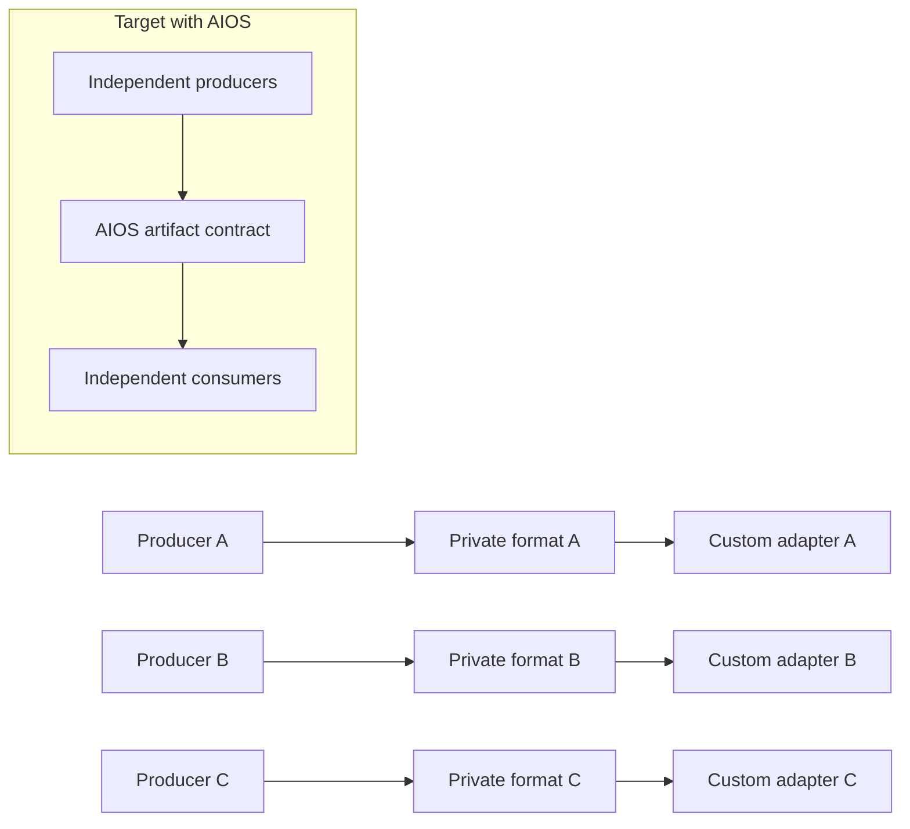
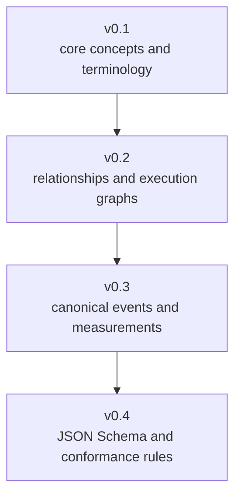
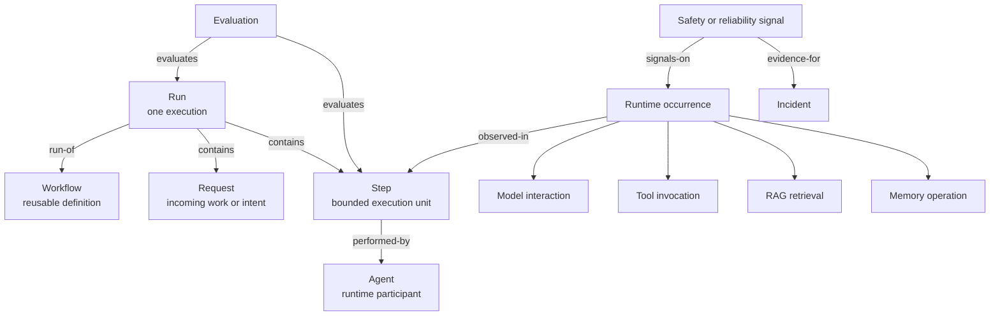
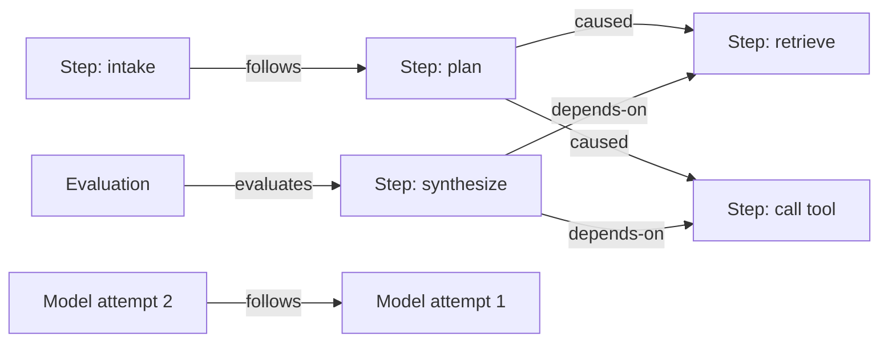
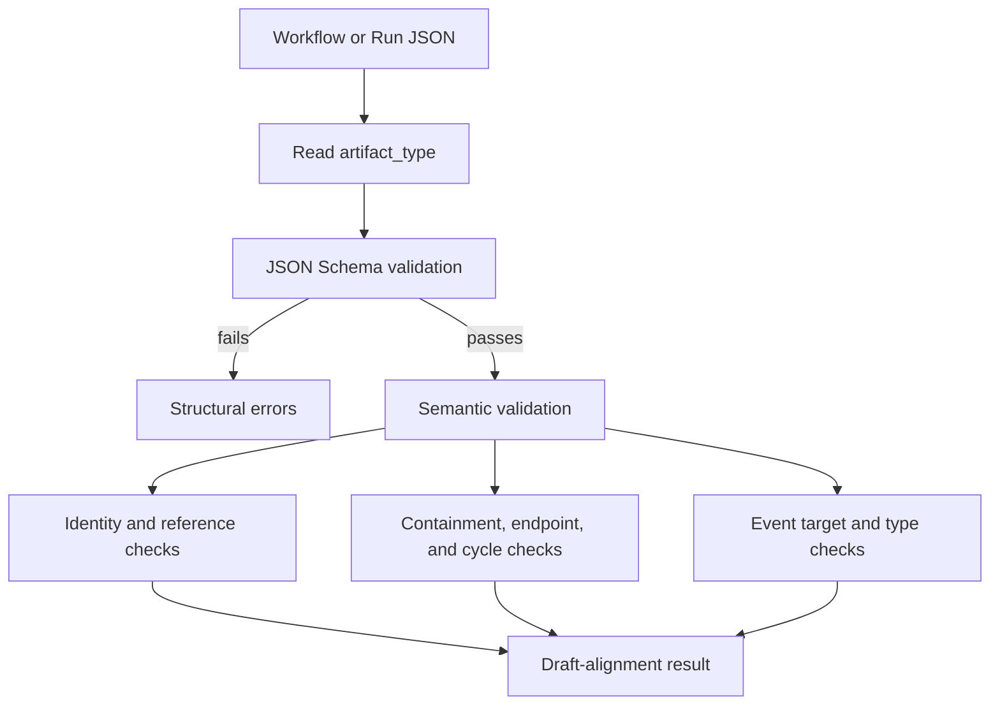

# AI Operations Specification

Repository: `ai-operations-spec`

## What it is

The AI Operations Specification, or AIOS, is a transport-neutral vocabulary
and artifact contract for describing how an AI system operated. It separates
the reusable process from an execution, the execution boundary from its
individual activities, and raw runtime signals from evaluations and incidents.

It is a specification repository, not an agent runtime, observability backend,
or chaos engine.

## Why it exists

Without a shared contract, every producer can describe runs, steps, tool calls,
evaluations, and failures differently. Every consumer then needs a custom
adapter. AIOS aims to let multiple independent producers and consumers agree
on object identity, relationships, event meaning, measurements, and extension
behavior.

This is the practical meaning of interoperability: a consumer should be able
to understand the evidence from the artifact contract, without importing the
producer's Python package or knowing its internal classes.

## The cumulative draft layers

The milestone folders are layers of one cumulative specification, not four
competing editions.

- v0.1 answers: **What things exist?**
- v0.2 answers: **How are those things related?**
- v0.3 answers: **How are operational events and measurements named?**
- v0.4 answers: **What must a machine-readable artifact look like, and how is
  it validated?**

All layers are pre-release drafts. The safe claim is: “aligned with the AIOS
v0.4 draft observed on a specific date.” The repo explicitly disallows a claim
of stable conformance at this stage.

## Conceptual model

The distinctions prevent common modeling errors:

- A Workflow is a definition; a Run is one execution.
- A Step is an execution boundary; it is not automatically an Agent or model
  call.
- Retrieval, memory, tools, and model calls remain distinct occurrences.
- A reliability event is evidence; it does not automatically become an
  Incident.
- An Evaluation is a disclosed judgment, not objective truth.

## Relationships make the run a graph

AIOS avoids assuming that agent workflows are simple sequential lists.

Identity and explicit edges let consumers distinguish containment, ordering,
causation, dependency, delegation, handoff, and evidence. Timestamps alone are
not allowed to prove causation.

## Artifact validation

Draft alignment requires both structural and semantic validation.

Schema validation alone cannot prove that relationship endpoints resolve, that
every Step is contained once, or that a graph is acyclic. Semantic validation
handles those invariants. Neither kind of validation proves that the evidence
is factually true or that the AI system was safe or successful.

## Extension model

Closed vocabularies cannot be expanded casually. Vendor or project-specific
data belongs in freeform attributes or reverse-domain extension namespaces,
for example `io.deepagentlabs.agenticlens.*`. Consumers must preserve unknown
namespaced extensions instead of treating them as errors.

## Current implementation status

Implemented in this repository:

- normative draft concepts, relationships, and semantic conventions;
- Workflow and Run JSON Schemas;
- valid, invalid, and semantically invalid examples;
- structural and semantic validator logic and tests;
- explicit pre-release claim rules.

Not provided by this repository:

- runtime instrumentation;
- storage or telemetry transport;
- AgenticLens or Agentic Chaos exporters;
- a stable compatibility guarantee;
- certification of third-party products.

## Demo explanation

> AIOS is our common operational language. It defines what a workflow, run,
> step, occurrence, evaluation, reliability event, and incident mean, plus how
> their identities and relationships are validated. Today it is a pre-release
> draft. Our tools can validate draft artifacts, but native ecosystem-wide
> production of one unified AIOS artifact is the next integration milestone.

Next: [AgenticLens](02-agenticlens.md) · [Current versus target](06-current-vs-target.md)

