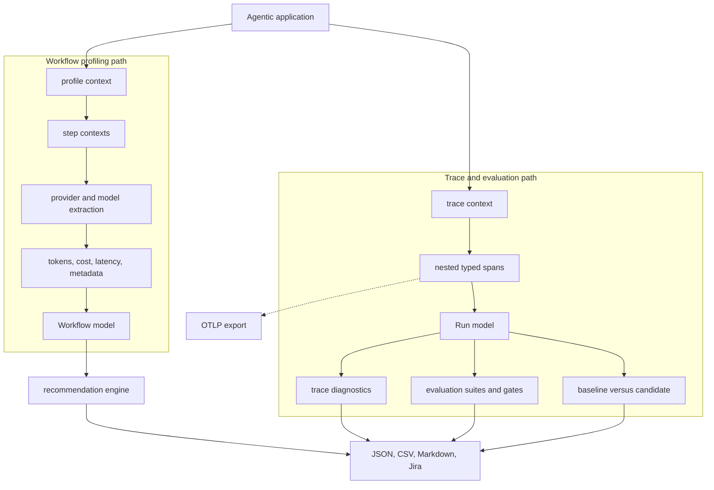
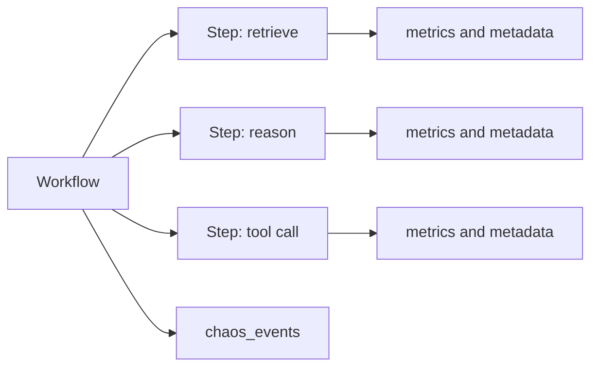
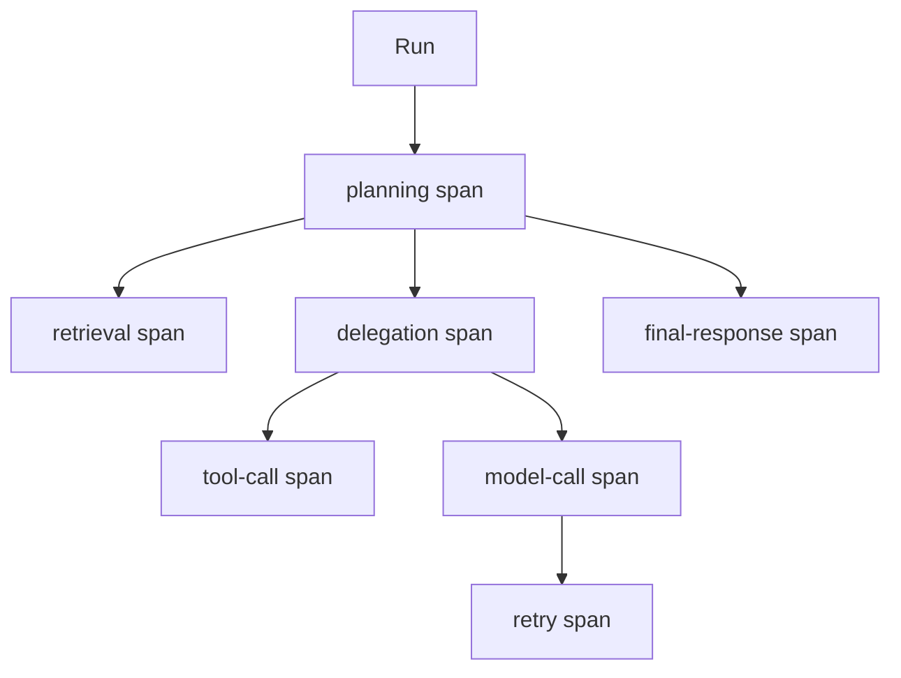
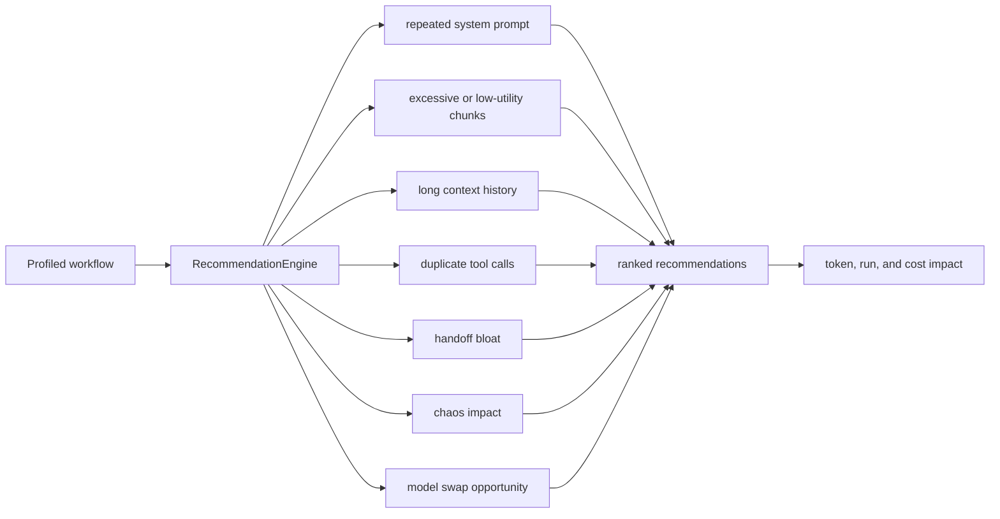
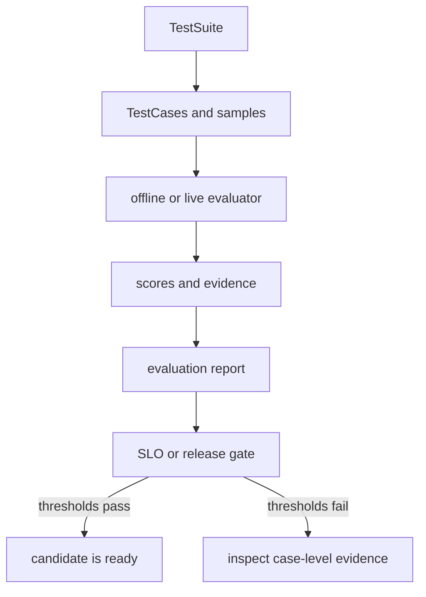
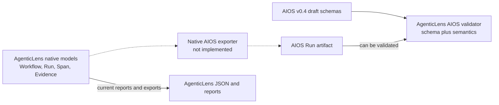

# AgenticLens

Repository: `agenticlens` · Current version: 0.4.0

## What it is

AgenticLens is the observation and evaluation layer. It captures what an agent
workflow did, measures operational behavior, finds optimization opportunities,
evaluates results, compares runs, and exports human- or machine-readable
reports.

## Two complementary data paths

The repository supports a lightweight Workflow profiler and a richer Run/Span
trace model. They solve related but distinct jobs.

### Workflow model

A Workflow contains top-level timing, a list of Steps, aggregate cost/token
properties, and an additive `chaos_events` list. Each Step can record its type,
agent, provider, model, handoff context, tokens, latency, cost, and metadata.

### Run and Span model

A Run has a `run_id`, `trace_id`, application and experiment metadata, status,
and a set of Spans. Spans have stable identities and optional parent IDs, which
form a validated acyclic execution tree.

Supported span categories include model calls, planning, memory reads and
writes, retrieval, tool calls, validation, retries, delegation, final response,
and custom work.

## From evidence to recommendations

Each recommender examines recorded evidence. The engine enriches findings with
estimated token and dollar impact, evidence references, and severity, then
sorts the results by likely value.

## Evaluation and release gates

This is deliberately separate from profiling. Runtime completion does not
prove answer quality; an evaluation discloses the criterion, method, score,
and evidence used to judge the result.

## CLI and library surfaces

The CLI exposes profiling, reporting, analysis, inspection, validation,
conformance checking, run comparison, offline/live evaluation, and gates. The
same core models and services can be called as a Python library. Exporters
cover JSON, CSV, Markdown, Jira-oriented output, and OTLP traces.

## Relationship to AIOS

Current reality:

- AgenticLens has its own documented and useful object models.
- It includes AIOS schema and semantic validation commands.
- Its Workflow can accept Chaos events through an additive integration field.
- It does **not** currently map its native Workflow/Run/Span objects into a
  complete AIOS v0.4 Run artifact.

Therefore the correct statement is “AgenticLens contains AIOS draft validation
support,” not “AgenticLens is already an AIOS producer.”

## Demo explanation

> AgenticLens is the microscope. It observes the workflow, connects steps and
> spans to cost, latency, tokens, evidence, and quality, then converts that
> evidence into recommendations and release decisions. It already understands
> how to validate an AIOS draft artifact, while the native AIOS exporter is
> still on the integration roadmap.

Previous: [AIOS](01-ai-operations-spec.md) · Next: [Agentic Chaos](03-agentic-chaos.md)

