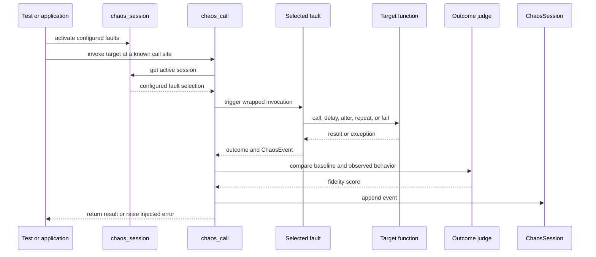
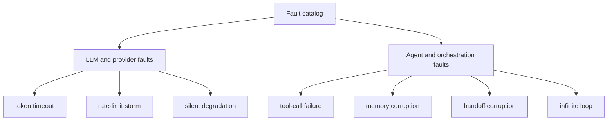
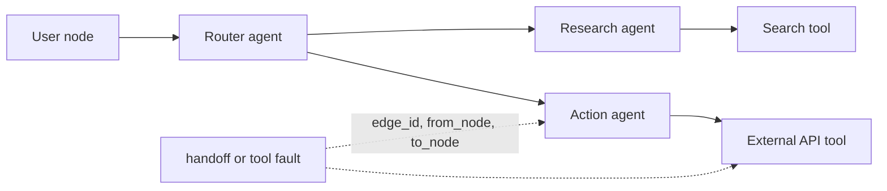
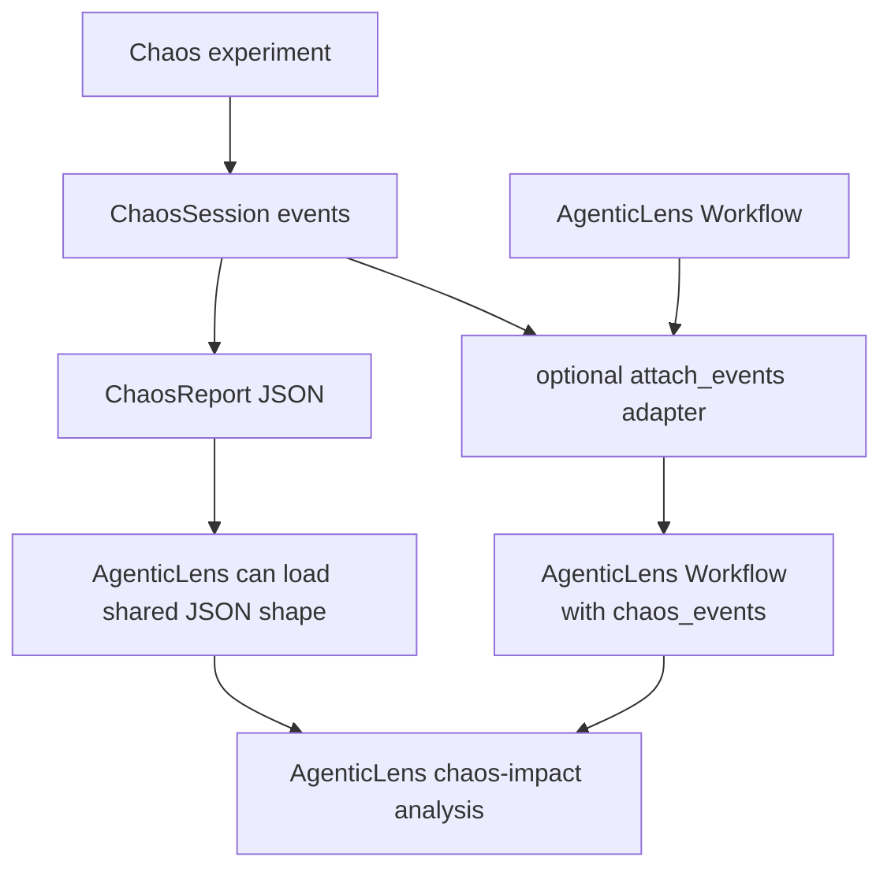
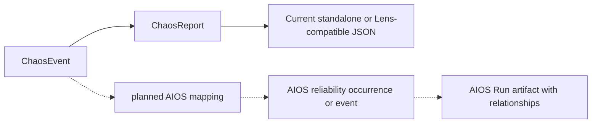

# Agentic Chaos

Repository: `agentic-chaos` · Current version: 0.3.0

## What it is

Agentic Chaos is the resilience-testing layer. It applies selected failures at
controlled call sites, observes the result, scores the outcome, and records a
typed chaos event. Outside an active chaos session, the wrapper is transparent
and calls the original function normally.

## Execution model

If multiple faults are configured, a call site selects which apply. This avoids
silently choosing a fault and makes experiments easier to reproduce.

## Fault families

The fault is only half the experiment. Each resulting `ChaosEvent` records the
fault type, affected step, timestamp, outcome, explanation, optional topology
edge, detailed evidence, and optional fidelity score.

## Agent topology integration

Topology-aware wrappers can retain which node or edge was affected. The
LangGraph helpers wrap nodes and tools, while the topology tracker captures the
agent structure relevant to an experiment.

That context makes a report more useful than “something failed”: it tells the
reader where the fault entered the agent graph.

## Standalone and AgenticLens modes

Agentic Chaos intentionally works without AgenticLens. Its standalone
`ChaosReport` shares selected top-level field names with the AgenticLens
Workflow model, enabling simple JSON interoperability without a runtime code
dependency.

The adapter is duck typed: Chaos does not import AgenticLens at runtime. It
appends serialized events to the Workflow's `chaos_events` array, and a helper
can copy step identifiers from an AgenticLens step handle into a chaos call.

## Relationship to AIOS

Chaos events are conceptually close to AIOS Reliability Events, but the current
`ChaosEvent` and `ChaosReport` models are not native AIOS artifacts.

A complete mapping must do more than rename fields. It must create valid AIOS
object identities, connect each occurrence to exactly one Step, target events
correctly, preserve measurement semantics, and use a namespaced extension for
Chaos-specific details.

## Current implementation status

Implemented:

- session-scoped fault activation;
- transparent call-through when chaos is disabled;
- LLM/provider and agent/orchestration fault catalogs;
- topology and LangGraph helpers;
- heuristic and optional evaluator-backed outcome judges;
- standalone ChaosReport output;
- optional AgenticLens event attachment.

Not yet implemented:

- a native AIOS Reliability Event or Run exporter;
- a combined AIOS artifact containing both Lens and Chaos evidence;
- a formal cross-tool AIOS interoperability test.

## Demo explanation

> Agentic Chaos is the wind tunnel. We deliberately introduce realistic
> failures—timeouts, rate limits, degraded responses, broken tools, corrupted
> memory, bad handoffs, or loops—and record how the agent behaves. We can feed
> those events into AgenticLens today; mapping them into the shared AIOS
> artifact is the next contract-level integration.

Previous: [AgenticLens](02-agenticlens.md) · Next: [MCP server](04-mcp-server.md)

