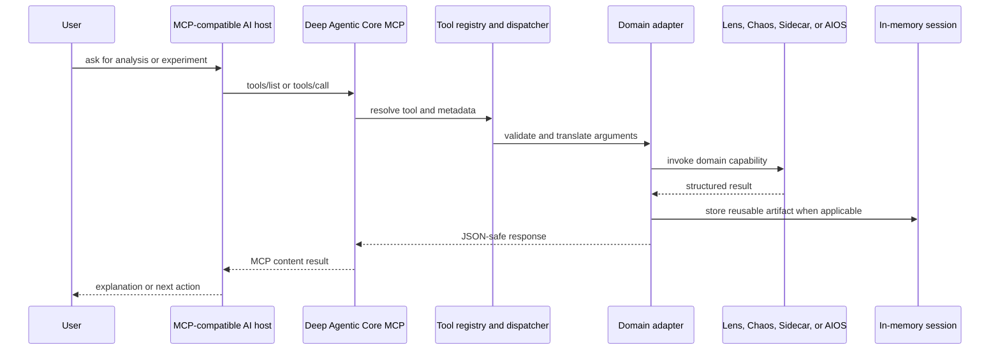
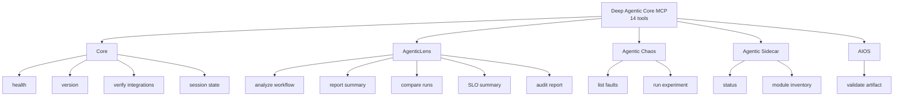
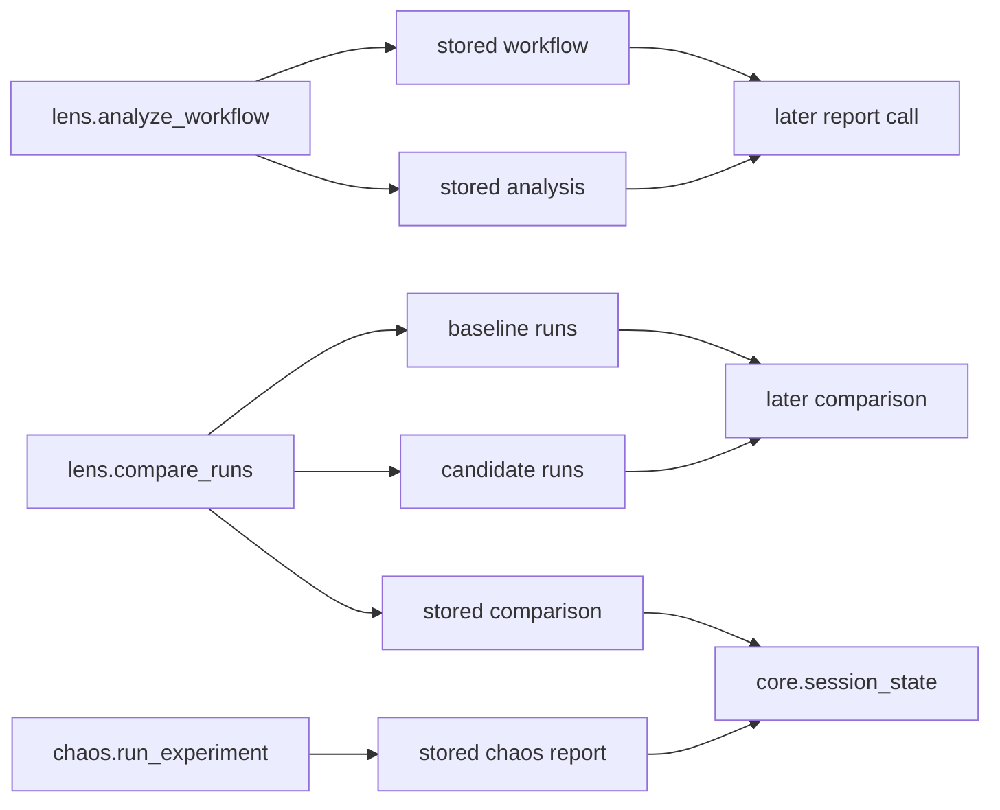
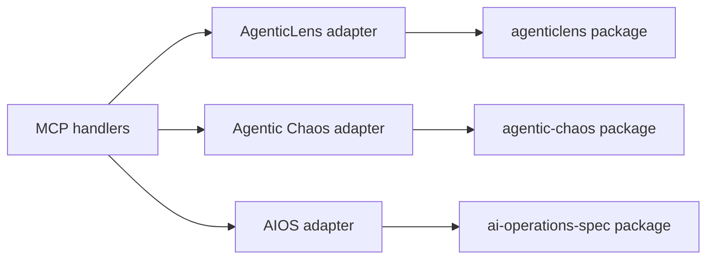
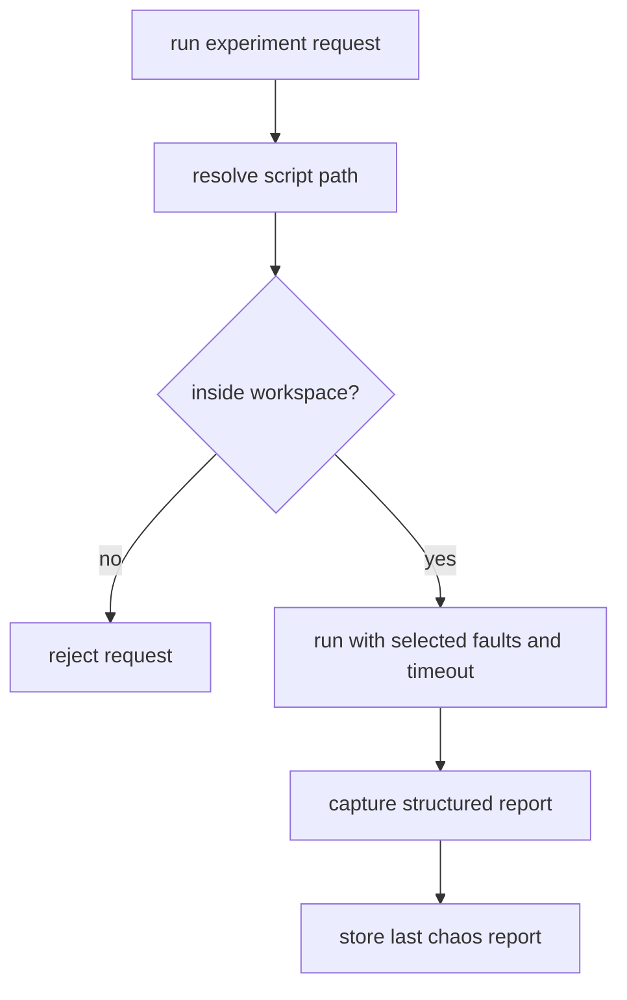
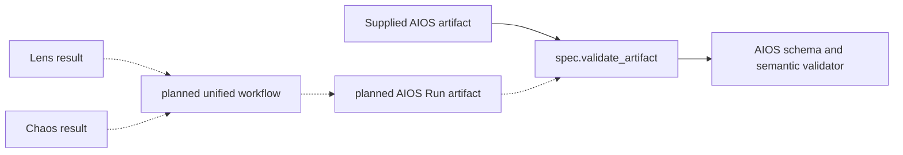

# Deep Agentic Core MCP server

Repository: `mcp-server` · Package: `deep-agentic-core-mcp` · Current version: 0.2.0

## What it is

The MCP server is the ecosystem's control surface. It uses the official MCP
Python SDK over standard input/output and exposes selected AgenticLens,
Agentic Chaos, Agentic Sidecar, and AIOS capabilities to an MCP-compatible host.

It is intentionally a thin orchestration layer. Domain logic remains in the
four underlying repositories and is reached through adapters.

## Request architecture

Known handler failures are returned as structured results; the server boundary
also catches unexpected exceptions so they do not escape as raw protocol
failures.

## Current tool surface

Sidecar's two tools are registered and callable, but `status` currently
reports a hardcoded `runtime_ready=False`/`package_status=scaffold` even when
a real Sidecar 0.2.0 runtime is installed — a known readiness bug, not a
missing feature. See the [ecosystem audit](ECOSYSTEM_AUDIT.md#mcp-server).

The server also advertises two JSON resources and three prompt templates.
Tool metadata tells a host about prerequisites, likely duration, session
mutation, read-only behavior, and open-world side effects.

## Session continuity

The in-memory session store lets sequential tool calls reuse evidence without
requiring the host to resend every artifact.

State is scoped by `session_id`, capped to a recent call history, and lasts
only for the life of the stdio server process. It is not a database or durable
evidence store.

## Adapter boundary

This boundary keeps protocol concerns out of domain code and allows the server
to report a missing optional package as an integration-readiness problem.

## Safety boundary for experiments

`chaos.run_experiment` is marked as slow, mutating, destructive/open-world in
MCP annotations because it executes a target script. The adapter constrains the
script path to the configured workspace and applies a timeout. The remaining
tools primarily read or derive from arguments and session state.

## Relationship to AIOS

The MCP server currently provides `spec.validate_artifact`, which validates a
supplied Workflow or Run against the AIOS v0.4 draft. It does not itself merge
AgenticLens and Chaos results into a new AIOS Run.

## Demo explanation

> The MCP server turns the ecosystem into an agent-accessible control plane.
> An AI client can discover tools, analyze a workflow, compare runs, launch a
> sandboxed chaos experiment, inspect session state, and validate an AIOS draft
> artifact. It orchestrates existing capabilities; unified AIOS artifact
> production remains planned work.

Previous: [Agentic Chaos](03-agentic-chaos.md) · Next: [Organization website](05-organization-website.md)

