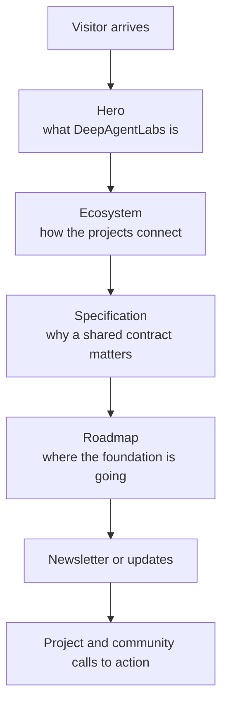
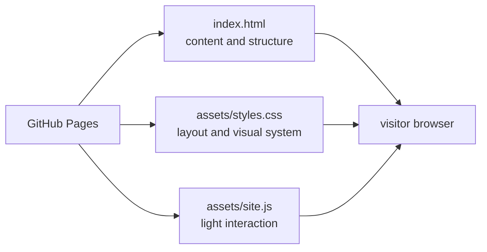
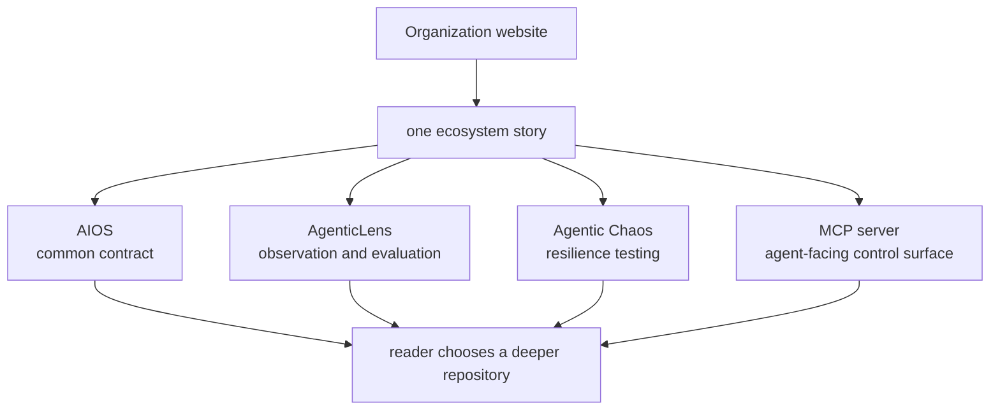

# DeepAgentLabs organization website

Repository: `deepagentlabs.github.io`

## What it is

This repository is the ecosystem's public front door. It is a static GitHub
Pages site that explains the foundation, connects the projects, presents the
roadmap, and provides calls to action.

It intentionally has no application server, dependency installation, or build
step.

## Page narrative

The website should communicate in outcomes and concepts. Detailed model fields,
CLI commands, and draft conformance rules belong in the repositories and this
technical guide.

## Technical shape

Publishing is branch based: the repository root is served by GitHub Pages, and
`index.html` becomes the organization URL. Local preview can open the file
directly or use any static file server.

## Role in the ecosystem

The site should avoid making claims that the implementation cannot yet support.
In particular, it should describe AIOS as a pre-release draft and distinguish
current AIOS validation from planned native artifact production.

## Demo explanation

> The website is the narrative layer. The four technical repositories define,
> observe, stress, and orchestrate the operating loop; this repository makes
> that system understandable and discoverable without asking visitors to read
> source code or run a command.

Previous: [MCP server](04-mcp-server.md) · Next: [Current versus target](06-current-vs-target.md)

