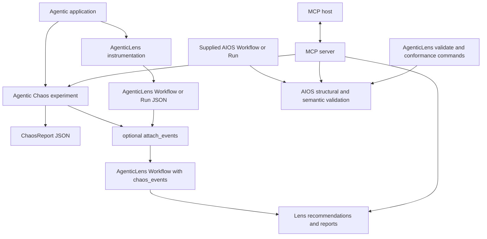
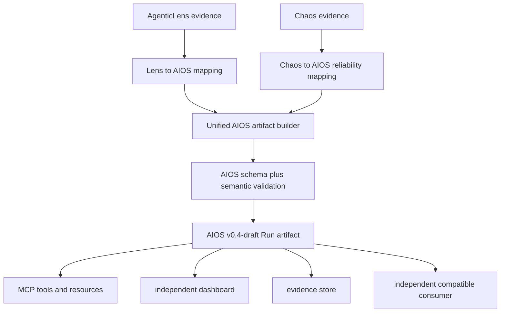
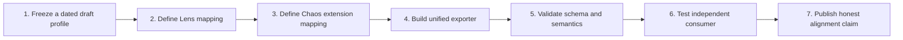

# Current implementation versus target architecture

This page is the most important qualification in the ecosystem story. The
repositories integrate today, but “integrated” and “AIOS-native” are not the
same claim.

## What works today

Today there are three relevant JSON boundaries:

1. AgenticLens native Workflow and Run/Span models.
2. Agentic Chaos `ChaosReport` and `ChaosEvent` models, with selected fields
   compatible with the AgenticLens Workflow loader.
3. AIOS draft Workflow and Run artifact schemas.

They are related, but they are not yet one object model.

## What the target looks like

The transformation boxes below represent implementation work, not current
production code.

The key proof is the last arrow: an independent consumer reads the artifact
without importing `agenticlens` or `agentic-chaos`.

## Gap matrix

| Capability | Current status | What closes the gap |
|---|---|---|
| AIOS vocabulary and relationships | Implemented as a pre-release draft | Complete review gates and compatibility/versioning policy |
| AIOS schema and semantic validation | Implemented | Continue draft evolution and independent validation coverage |
| AgenticLens native observation and reports | Implemented | No AIOS dependency required for current use |
| Agentic Chaos native experiments and reports | Implemented | No AIOS dependency required for current use |
| Chaos events inside AgenticLens Workflow | Implemented through an optional adapter/shared JSON shape | Strengthen cross-package contract tests |
| MCP access to Lens, Chaos, and AIOS validation | Implemented with 12 tools | Add higher-level unified workflows as stable primitives emerge |
| AgenticLens to AIOS exporter | Not implemented | Deterministic Workflow/Run/Span-to-AIOS mapping |
| Agentic Chaos to AIOS exporter | Not implemented | Reliability event, target, measurement, and extension mapping |
| Unified Lens plus Chaos AIOS Run | Not implemented | Artifact builder, ID strategy, relationship construction, validation |
| Independent consumer proof | Not implemented | Golden artifact and consumer test with no Lens/Chaos imports |
| Stable AIOS compliance claim | Not currently available | Stable specification release and applicable conformance gates |

## A practical implementation sequence

### 1. Freeze the claimed draft snapshot

Record the exact v0.4-draft snapshot/date used by the exporter. Drafts do not
promise compatibility across snapshots.

### 2. Map AgenticLens identities and evidence

Define deterministic mappings for Workflow, Run, Step, Span/occurrence,
Evaluation, measurement, and relationships. Unknown values must remain unknown;
the exporter must not invent data to satisfy a field.

### 3. Map Chaos as reliability evidence

Represent each injected event with a distinct identity and a resolvable target.
Use canonical AIOS reliability semantics where they fit, and a reverse-domain
extension namespace for experiment-specific details such as fault configuration
and fidelity scoring.

### 4. Build one artifact

Combine both mappings under one Run boundary. Preserve every Step exactly once,
connect each runtime occurrence to one Step, and retain retry and topology edges
explicitly.

### 5. Validate twice

Run JSON Schema validation, then semantic validation for IDs, endpoints,
containment, cycles, event targets, and retry structure.

### 6. Prove interoperability

Create a small consumer in a clean environment that imports neither producer.
It should load the artifact and answer questions such as:

- Which workflow and run produced this evidence?
- Which step was faulted?
- What was the observed outcome and recovery behavior?
- Which evaluation judged the final result?
- What were the latency, token, and cost measurements?

### 7. Make the precise claim

Until AIOS is stable, use dated language such as:

> Aligned with AI Operations Specification v0.4-draft as observed on
> YYYY-MM-DD.

## The meeting-ready answer

If someone asks, “Are these tools AIOS compliant today?”, answer:

> Not as end-to-end AIOS producers yet. The AIOS draft, schemas, examples, and
> structural-plus-semantic validation exist. AgenticLens and Agentic Chaos work
> today using their native evidence models, and MCP exposes their capabilities
> plus AIOS validation. The missing step is a native mapping and unified
> exporter, followed by an independent-consumer interoperability test. Because
> AIOS itself is pre-release, the eventual near-term claim will be dated draft
> alignment, not stable compliance.

Back to the [ecosystem overview](README.md).

