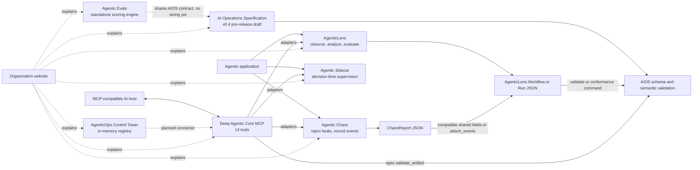
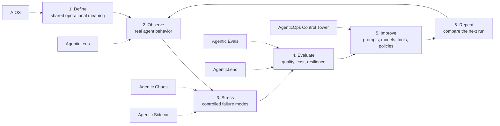

# DeepAgentLabs ecosystem guide

See the [2026-09-11 ecosystem implementation audit](ECOSYSTEM_AUDIT.md) for
source-backed status across all repositories, verified integration gaps, and
test results. The narrative below is an earlier snapshot; the audit records
its version and inventory discrepancies.

This guide explains the eight repositories as one system. It is written for a
technical demo, architecture review, or onboarding conversation; no terminal
is required to follow it.

## The ecosystem in one sentence

DeepAgentLabs is building an operational foundation for agentic AI: a shared
draft contract for evidence, instrumentation that explains agent behavior,
controlled failure testing, decision-time supervision, standalone evaluation
scoring, a fleet registry, an MCP control surface, and a public website.

## Repository map

| Repository | Role | Current version | Best one-line explanation |
|---|---|---:|---|
| [`ai-operations-spec`](01-ai-operations-spec.md) | Contract | Package 0.1.0; specification through v0.4-draft | Defines the common operational vocabulary, relationships, events, and artifact validation rules. |
| [`agenticlens`](02-agenticlens.md) | Observe and evaluate | 0.5.0 | Captures agent runs, calculates cost and latency, finds inefficiencies, evaluates quality, and produces reports. |
| [`agentic-chaos`](03-agentic-chaos.md) | Stress and learn | 0.4.0 | Injects controlled LLM and agent failures, then records what happened and how well the system recovered. |
| [`agentic-sidecar`](https://github.com/DeepAgentLabs/agentic-sidecar/blob/main/README.md) | Govern | 0.2.0 | Watches an agent's next action against its declared intent and can allow, warn, or block it in real time (LangGraph only today). |
| [`agentic-evals`](https://github.com/DeepAgentLabs/agentic-evals/blob/main/README.md) | Evaluate, standalone | 0.5.0 | Framework-agnostic scoring engine extracted from AgenticLens's eval module — deterministic checks, LLM-as-judge, and a CI release gate. Not yet called by any other repo in this list. |
| [`agenticops-control-tower`](https://github.com/DeepAgentLabs/agenticops-control-tower/blob/main/README.md) | Operate | 0.0.1 | The intended fleet-wide registry and control plane; today an in-memory agent registry with no persistence, console, or live connectors. |
| [`mcp-server`](04-mcp-server.md) | Orchestrate | 0.2.0 | Makes Lens, Chaos, Sidecar, and AIOS validation available to MCP-compatible AI clients as 14 tools, 2 resources, and 3 prompts. |
| [`deepagentlabs.github.io`](05-organization-website.md) | Explain and distribute | Static site | Presents the product story, roadmap, and links without a build pipeline. |

Versions above describe the checked-out code. AIOS package and draft milestone
numbers have different meanings: the Python package is `0.1.0`, while the
cumulative specification currently reaches `v0.4-draft`. `agenticops-control-tower`'s
own README describes itself as a "v0.1/v0.2 scaffold," which does not match its
`0.0.1` package version — that mismatch is unresolved, not a typo here.

## How the pieces fit today

The solid arrows below are implemented in the current repositories.

Important: the diagram does **not** say that Lens or Chaos currently emits a
native AIOS Run artifact. Lens can validate an artifact supplied to it, and
MCP can invoke AIOS validation, but the native AIOS exporters and the unified
Lens-plus-Chaos artifact are still target work.

## The intended operating loop

AIOS is the contract underneath the loop, not another observability runtime.
AgenticLens and Agentic Chaos are the evidence producers today, using their
own documented JSON models. Agentic Sidecar adds decision-time supervision;
Agentic Evals adds standalone scoring. AgenticOps Control Tower is the
intended coordination point across all of them, and MCP is the interaction
layer through which an AI assistant can invoke the available capabilities.

## Suggested presentation order

1. Start with the ecosystem diagram and the operational loop.
2. Explain AIOS as the common language, while clearly calling it a draft.
3. Show AgenticLens turning execution data into evidence and recommendations.
4. Show Agentic Chaos creating repeatable failure evidence.
5. Show MCP exposing the Lens, Chaos, Sidecar, and AIOS validation
   capabilities without requiring the audience to watch terminal commands.
6. Finish with [current state versus target architecture](06-current-vs-target.md).

## Documentation index

- [AI Operations Specification](01-ai-operations-spec.md)
- [AgenticLens](02-agenticlens.md)
- [Agentic Chaos](03-agentic-chaos.md)
- [Agentic Sidecar](https://github.com/DeepAgentLabs/agentic-sidecar)
- [Agentic Evals](https://github.com/DeepAgentLabs/agentic-evals)
- [AgenticOps Control Tower](https://github.com/DeepAgentLabs/agenticops-control-tower)
- [Deep Agentic Core MCP](04-mcp-server.md)
- [Organization website](05-organization-website.md)
- [Current implementation versus target](06-current-vs-target.md)

